# Designing IT for my EVE Echoes Alliance

## Intro

My light-hearted observation as an alliance leader is that EVE is 50% in-game, 50% discord, and 50% Google Sheets.
The idea is to create a solution for organizing my online gaming community that meets my users where they are: Discord and Google Sheets. 

Getting the discord part, with its support for bots, has come naturally. But what's often missed is an integration between Sheets and Discord. For example, editing data through Discord usually means it is no longer easily accessible, or up-to-date in sheets as the tendency is to move it to a database. Granted that has a lot of advantages and seems like the obvious thing to do, but it does have two main trade-offs that I think should give people pause: 

* Adding back the bulk CRUD operations that come easily in sheets once you've moved to SQL or another DB is added work and time. 
* Google Sheets requires no maintenance and is free. This reduces my time spent as it/dev ops for my community. 
* Everyone knows how to use sheets and build on them. It is easily extensible, and once again this requires no work or time from me.

So with that in mind, the solution that I've been prototyping for managing my alliance, corporation, and pilots in the game uses Google Sheets as as the primary user interface. That means that it is also a primary store of data. The goal is for both Discord and Google Sheets to allow for the writing of data, though it doesn't mean they need to have all the same features. 

What follows is a walkthrough starting with scenarios that lead to the why and how of implementing an MVP of managing my EVE community's data via Discord and Google Sheets.

## Scenarios

These are the scenarios that must be supported for this solution to fit my needs:

* Bulk Update from Google Sheets by admins.
* Updates of individual rows by discord users via discord commands
* Invidiaul users can update their corp, clone, or otherwise a row of data from Discord via a command.
* Enable some users to perform analytics over the data.

## Requirements and Constraints

* The data set is small. It can fit in memory with no chance of ever growing beyond that.
* The expected peak requests per second are fractional. But let's go with 10 to leave a lot of headroom. 
* Latency is important, but to a point. I want to avoid incidental latency from bad choices, but I won't go so far as to write the whole thing in C++ or deploy it to multiple regions. 
* Durability: If an update comes from Discord, it should not be lost on crash. There may, however, be a caveat here for conflict resolution to still roll back the update. 

## Design

I'll start by incrementally building the solution by adding the requirements one at a time, while minimizing the amount of work, and then see how it compares to a basic crud app. 

Starting with just the requirement for discord users, we can start with a basic process and a store. Two boxes and a line, I won't draw that. I will say that something like SQLite is enough for the store in this case, as it can be in process. And worth repeating that the entire data set can be held in memory. 

Next, we add the requirement to bulk update and analyze data. Again, we can use a basic design here, with the store being any that persists beyond the discord bot, like a SQL instance, Cosmos, or a k/v store (none of the requirements have constrained that implementation yet). But, to keep the work to a minimum, and because I want to try it, we're going to make the backend store a Google sheet. This gives us an admin view, authorization, and bulk edit, all for free. We can also do analytics over the sheet using... other sheets. And, if we update the sheet live, all that propagates as well. 

How does this affect latency and other details? 
* One, I'm going to assume, (though I have not tested it), that Google Sheets does add more latency than the other options, especially on read.  
* Two, Google Sheets has no atomic updates using optimistic concurrency. It has no etags in its API. 

We'll deal with two much later. But with one, we're going add a second store to handle read/writes, and then sync them to sheets.

So, what have we arrived at? If you imagine a basic CRUD app, we've removed the (likely) js front end, replaced it with sheets, and added a sync to the primary store to compensate. Both arrangements have an additional Discord bot client to handle the Discord aspects. The bet is that using sheets but having the sync is cheaper in development and maintenance than a js front end. I've left the implementation of the store open-ended until the next section.


A diagram of the result, with some additional details of the interactions:

```mermaid
graph LR;
 User --Slash commands--> Discord
 Discord --API Gateway-->DiscordBot;
 DiscordBot--Discord Client-->Discord;
 DiscordBot <--??-->Store;
 GoogleSheets <--sync--> Store;
 Admin <--⌨️,👀--> GoogleSheets
 Admin --Slash commands--> Discord
```




An update from Discord, to show that updates to Google Sheets are eventually consistent, not atomic. 


We have potentially created an issue. We've traded off consistency for reduced latency. It is now possible to temporarily see different results in sheets than in Discord until the sync happens. It is also possible, without a lot more work,  to create conflicts if both are updated simultaneously. 

For the moment, I'm going to say that this is ok. I say this given the context of the small number of users, and the available resources (that is to say: none), and that the users themselves can easily fix any issues that come up from conflicts. The next step is still to create an MVP and see if this is a problem at all in this context. If this is for a Fortune 500 company with a well-funded dev team, my answer would be very different. And that's the point.

## MVP

For the MVP, the thing I choose to focus on is my admin users and getting the correct data in bulk. That means: Discord is read-only to start with. This avoids needing a sync, for the moment. However, to choose the store I do need to plan ahead. 

For the choice of the store:
It looks a lot like a cache. So Redis is an option. It can also be an SQL instance. Revisiting the requirements: durability is important here, and it needs to sync updates back to the Google Sheets store. With that in mind, I came up with two options that kept the maintenance down by avoiding standing up a Redis cluster or SQL instance:

1) Discord Bot uses Raft.Next: https://dotnet.github.io/dotNext/features/cluster/raft.html. Ensure availability, and that no updates are lost (assuming multiple nodes)

2) Cosmos. Free for this scale, and has a change feed processor to ensure all updates are eventually processed. And this almost certainly uses a consensus algorithm, like Raft, under the hood (as does SQL in replication scenarios).

I got fairly far with 1), but decided that if I ever wanted anyone to help me 2) is the more maintainable option. Finally, the sync from sheets to cosmos, for the MVP, is triggered via discord command. So for the MVP we have:

```mermaid
graph LR;
 User --Slash commands, read-only--> Discord
 Discord --API Gateway-->DiscordBot;
 GoogleSheets -.Via Bot.-> Cosmos
 DiscordBot--Discord Client-->Discord;
 DiscordBot <--Cosmos client-->Cosmos;
 DiscordBot <--Sheets client-->GoogleSheets;    
 Admin <--⌨️,👀--> GoogleSheets
 Admin --Slash commands, read-only--> Discord    
```


I will end here for now. The next updates will be about what this MVP showed, and iterating the design from there. 

## Disclaimer: 
Not generated using AI. Edited with the help of Grammarly. 

## Acknowledgment
Mermaid integration achieved with help from: https://jackgruber.github.io/2021-05-09-Embed-Mermaid-in-Jekyll-without-plugin/

<a href="https://www.buymeacoffee.com/sarpedontdw" target="_blank"></a>